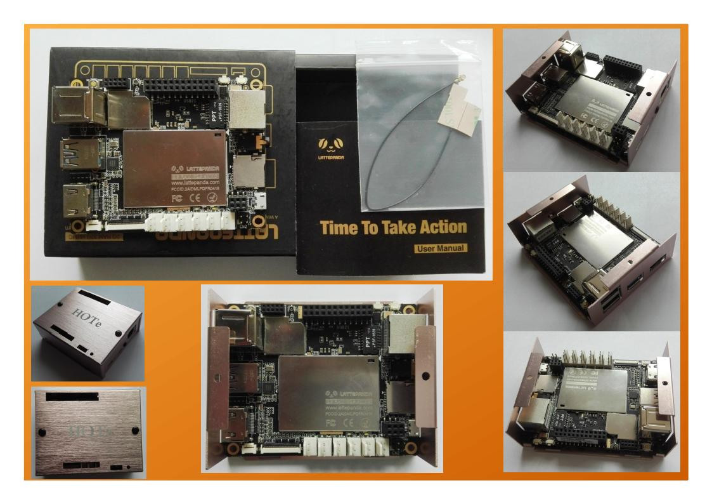

# LattePanda入手笔记

## 绪论

LattePanda<https://www.lattepanda.com/>一个神奇的板子，它是可以运行Win10系统的单扳机。知道它已经有很多年了。那是因为一个项目，一个独立的电话录音机项目。它采用的是LattePanda作为主控设备，将我们原有的USB接口的电话录音机板子集中到LattePanda，由于它可以运行Win10系统，所以我们原有的windows应用程序可以很容易的移植到这个产品上面来。是我们的产品可以脱离电脑作为一个独立的产品销售。这是我们选择它的一个主要的原因。

做为这个项目，我的主要工作是将所有产品整合到一个盒子里面去。实际的应用程序修改主要有我们英国的同事来完成的。对于LattePanda的使用，我也是最近才接触到。写这个笔记，仅作为一个记录而已。

## 入手

#### LattePanda样机购买

对于LattePanda的购买，我一直搞不明白一些道理。作为一个国内的企业，做的板子在国内买的价格却比国外买的贵，难道它是在国外做的？不管怎么讲，这是人家的价格策略，我们无从说三道四。我们只考虑用还不用，买还是不买就行了。经过一番搜索，发现rs-online上面的价格含税了也比国内的便宜。于是果断入手，在rs-online上买了这块样品。

#### 外壳

最近我设计了一款LattePanda的外壳<https://hnhkj.github.io/blog/hote/lpa/README_cn>，铝合金钣金外壳，拉丝工艺，金色。外观自我感觉还是很漂亮的。

## 使用入门

#### 