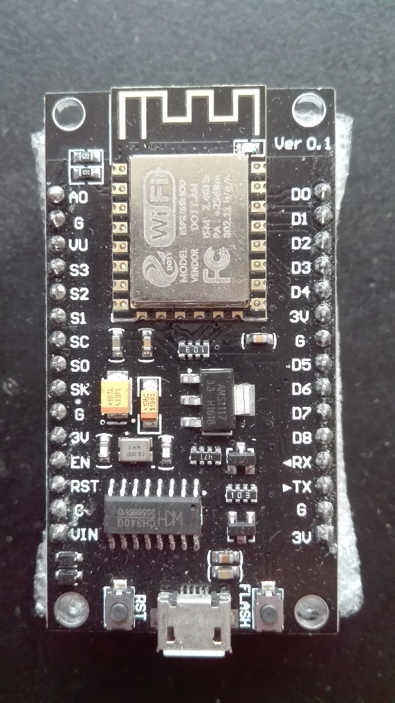

# nodeMCU入手记录

## 前言

闲来无事,打算将ESP8266拿起来在玩一下.看看能不能将ESP8266用到我们的产品上面来.之前乱七八糟买了一大堆的ESP8266的板子,也玩过一阵子.不过都没有做成产品.

前两天,买了ESP32的板子来玩了一下.在ubuntu下面将ESP32的开发环境进行了安装.并且也编译烧录了一下IC.感觉ESP32的开发环境简单了许多.也简化了许多,经过简单的几个步骤就可以顺利完成了.以前的ESP8266的开发环境建立.那可真的是费了老鼻子力气,用起来还很不爽.什么虚拟机,镜像文件了,什么......,看起来都头晕.看到ESP32的这个开发环境这么简单这么爽,我想他们一定也对ESP8266的开发工具进行优化了吧,如果优化了的话,那不是很爽.毕竟ESP8266的价格还是很厚道的.能用ESP8266那就不用ESP32了.所以试试看.这不,就买了这款nodeMCU.不为别的,只是因为它有USB口,烧录起来方便.不用找什么USB的适配器.这样多简单.我之前的一大堆板子都要用一个USB的串口板子.用起来还的连接这里连接那里.麻烦!

好了,说了这么一大堆,都是废话.先来看看板子.上一张照片.

板子是在某宝上面淘来的,不过拿到手上感觉像是山寨的.为什么呢?因为我看到espressif推荐的模块焊接方式是要将模块的PCB天线外漏出来,这个板子的模块天线和PCB都重合到一起了.我感觉这应该是有问题的.不过现在还没有去深入了解这个.先不管它了,以后再说.

## ESP8266开发环境

关于ESP8266的开发环境,我单独写了[一篇文章](esp8266_sdk.md),大家可以在我的论坛里面找到它.我测试过的,可以用.和ESP32一样,建立起来很容易.不过我是在ubuntu下面创建的.如果是windows下面,可能还是要和以前的一样.这个我们有去深究.在ubuntu下面做开发,有时候还是很不错的.毕竟现在linxu的开发板价格实在是诱人.在ubuntu下面搞好的东西,基本上就可以随便用了.在windows线搞好的东西还要该来该去,要不就用LattePanda吧.不过LattePanda价格也真的只能玩玩而已.

