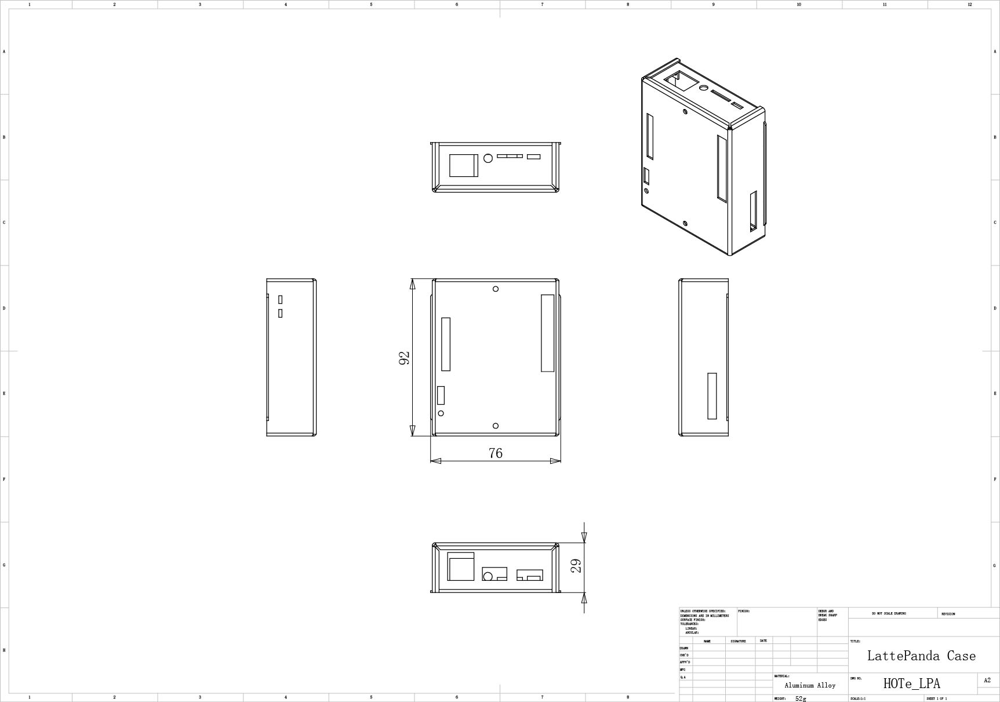

# HOTe-LPA LattePanda Aluminum alloy case

[cn](README_cn.md)

## Desctription:

LattePanda Case, It's used for a LattePanda product, LattePanda 3D file download from link <https://github.com/LattePandaTeam/LattePanda-3D-Models.git>. LattePanda is A Powerful Windows 10 Mini PC. If you hope to know more information about LattePanda, Please refer to Lattepanda web <https://www.lattepanda.com>

## 3D view

If you hope to know all of information, You can download 3D files 
[HOTe-LPA-3d](HOTe-LPA-3d.pdf). You need to download the latest Adobe Reader software to open it.<www.adobe.com> 

## Specification:

* Model: HOTe-LPA
* Material: Aluminum Alloy
* Size：92mm(L)x76mm(W)x29mm(H)
* Weight: 52g

[Download](HOTe_LPA_Drawing.pdf)

## Packing

* a Aluminum Alloy Case 

## Product

