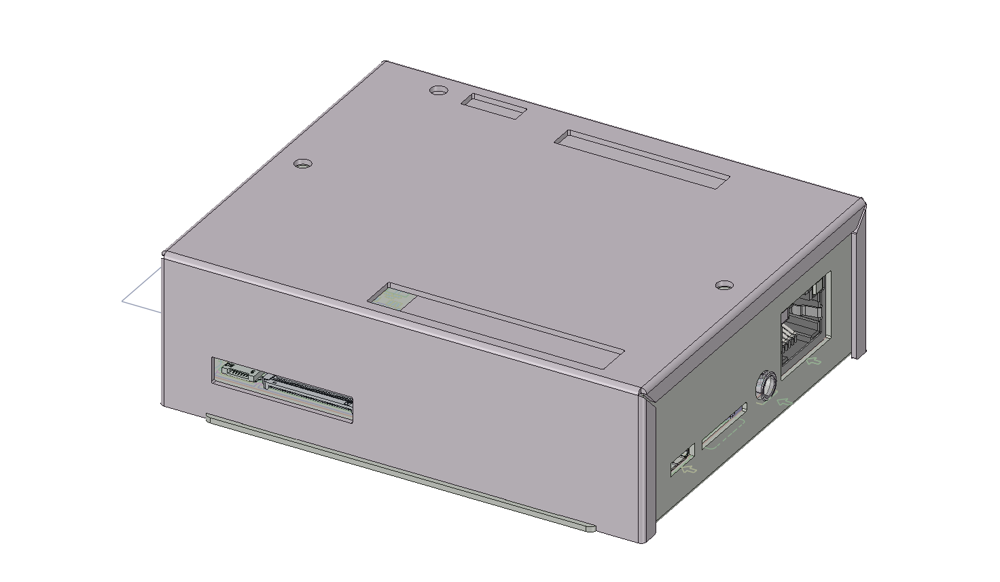
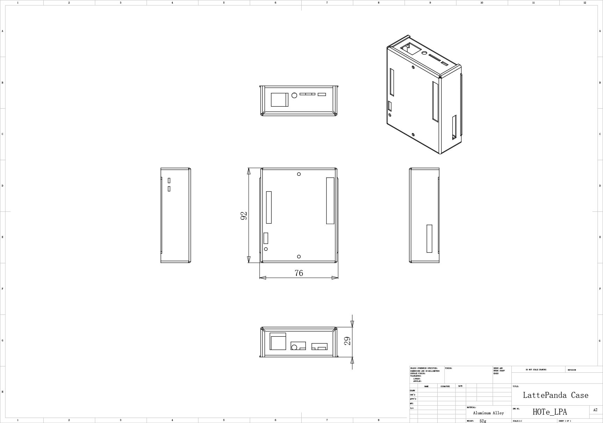

# HOTe-LPA LattePanda铝合金外壳

[en](README.md)

## 描述

LattePanda外壳,用来装配LattePanda 2G/3G产品。LattePanda是一台强大的Windows 10迷你电脑。 如果你希望了解更多的LattePanda信息，可以登录<www.lattepanda.com>了解。

## 3D预览

如果你希望了解更多的细节，你可以下载3D文件
[HOTe-LPA-3d](HOTe-LPA-3d.pdf)。该文件需要下载最新的Adobe Reader软件打开。Adobe Reader下载地址<www.adobe.com>。

## 规格

* 型号: HOTe-LPA
* 物料: 铝合金
* 尺寸: 92mm(长)x76mm(宽)x29mm(高)
* 重量: 52g

[下载](HOTe_LPA_Drawing.pdf)

## 包装

* HOTe_LPA铝合金外壳一套

