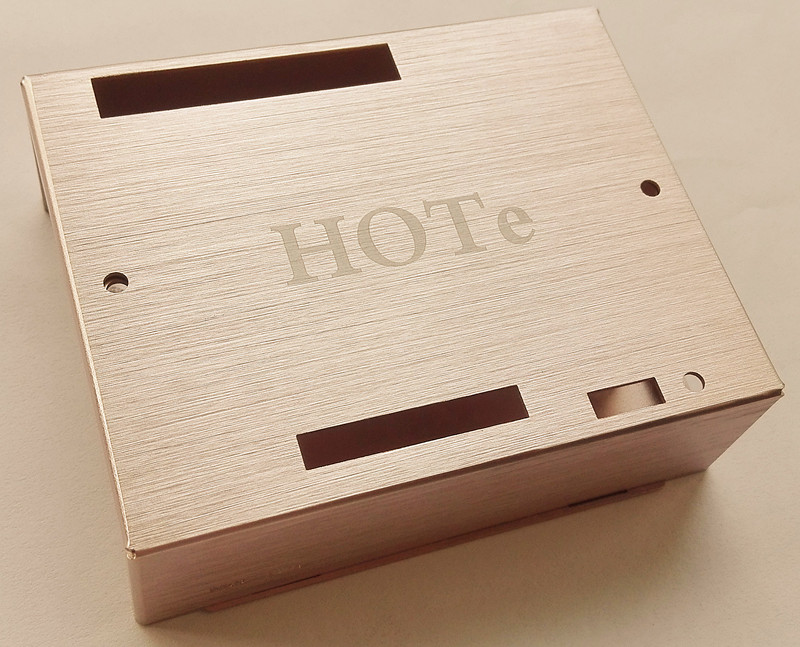
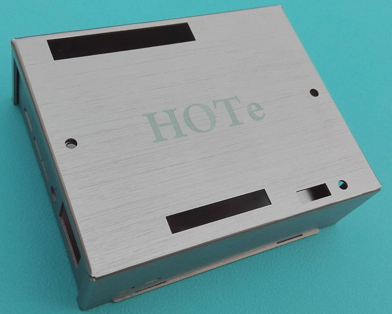
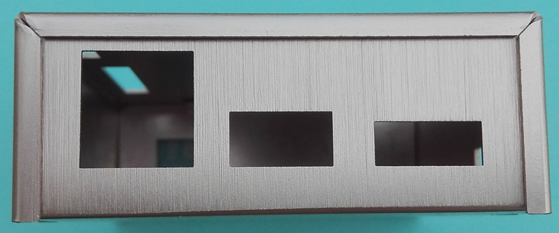

# HOTe-LPA LattePanda铝合金外壳

[en](README.md)

## 描述

LattePanda外壳,用来装配LattePanda产品,LattePanda 3D文件可以在<https://github.com/LattePandaTeam/LattePanda-3D-Models.git>下载。LattePanda是一台强大的Windows 10迷你电脑。 如果你希望了解更多的LattePanda信息，可以登录Lattepanda官方网站<https://www.lattepanda.com>进行了解。

## 3D预览

如果你希望了解更多的细节，你可以下载3D文件
[HOTe-LPA-3d](HOTe-LPA-3d.pdf)。该文件需要下载最新的Adobe Reader软件打开。Adobe Reader下载地址<www.adobe.com>。

## 装配预览

## 规格

* 型号: HOTe-LPA
* 物料: 铝合金
* 尺寸: 92mm(长)x76mm(宽)x29mm(高)
* 重量: 52g

[下载](HOTe_LPA_Drawing.pdf)

## 包装

* HOTe_LPA铝合金外壳一套

## 外壳 (产品图片仅供参考,产品颜色和图片有差异)

