# HOTe-RPA RaspberryPI 3B+ Raspberry PI Aluminum alloy case

[cn](README_cn.md)

## Desctription

HOTe-RPA case, It's used for a Raspberry Pi and Raspberry Pi PoE. Raspberry Pi 3 Model B+ link： <https://www.raspberrypi.org/products/raspberry-pi-3-model-b-plus/>；Raspberry Pi PoE HAT link: <https://www.raspberrypi.org/products/poe-hat/>。about Raspberry Pi product detail information. Pelase see <https://wwww.raspberrypi.org>.

## 3D Preview

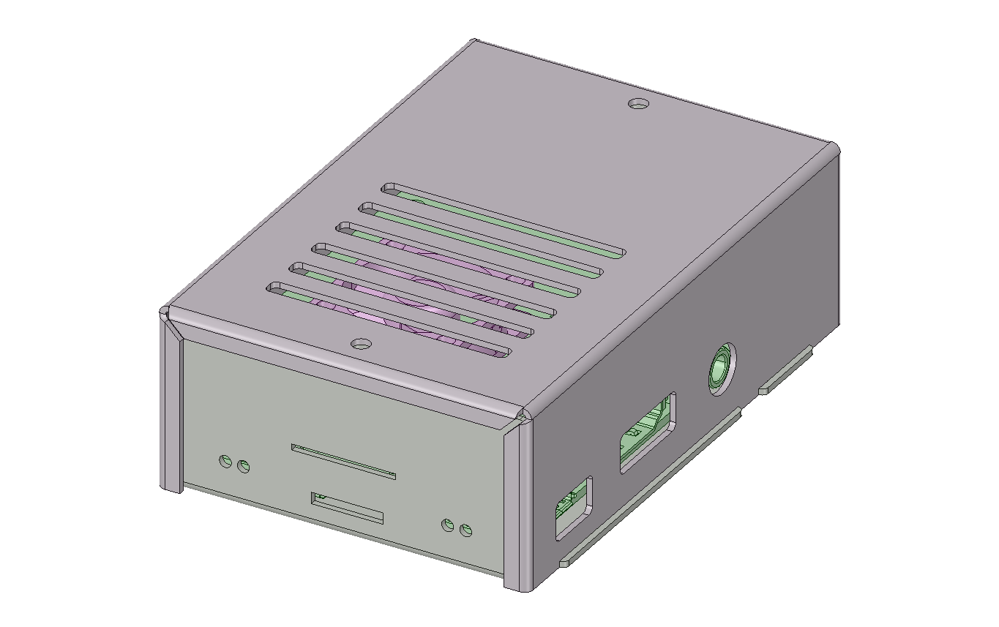

If you hope to know all of information, You can download 3D files [HOTe-RPA-3d](HOTe-RPA-v1.2.pdf). You need to download the latest Adobe Reader software to open it. Adobe Reader download link <https://www.adobe.com>.

## Assembly Preview

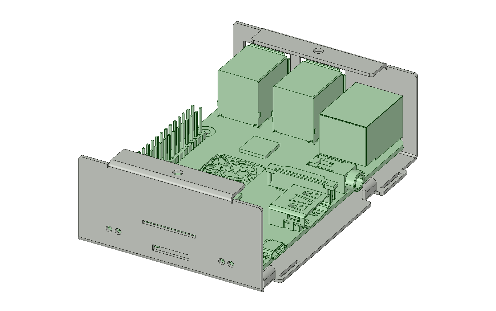

## Specification

* Model: HOTe-RPA
* Material: Aluminum Alloy
* Size：91mm(L)x64mm(W)x30mm(H)
* Weight: 46.7g

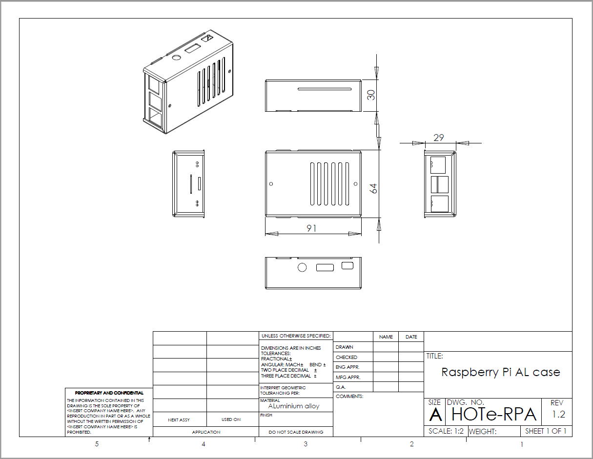

[download](HOTe-RPA_Drawing.pdf)

## Packing

* a Aluminum Alloy Case 

## Product (picture for reference only, product color is different with picture)

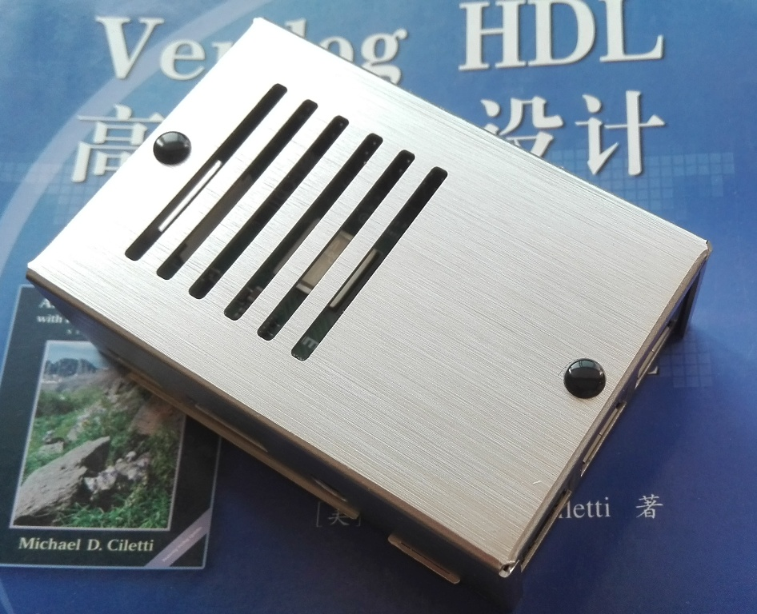

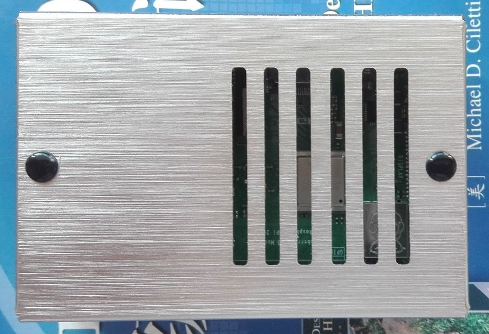

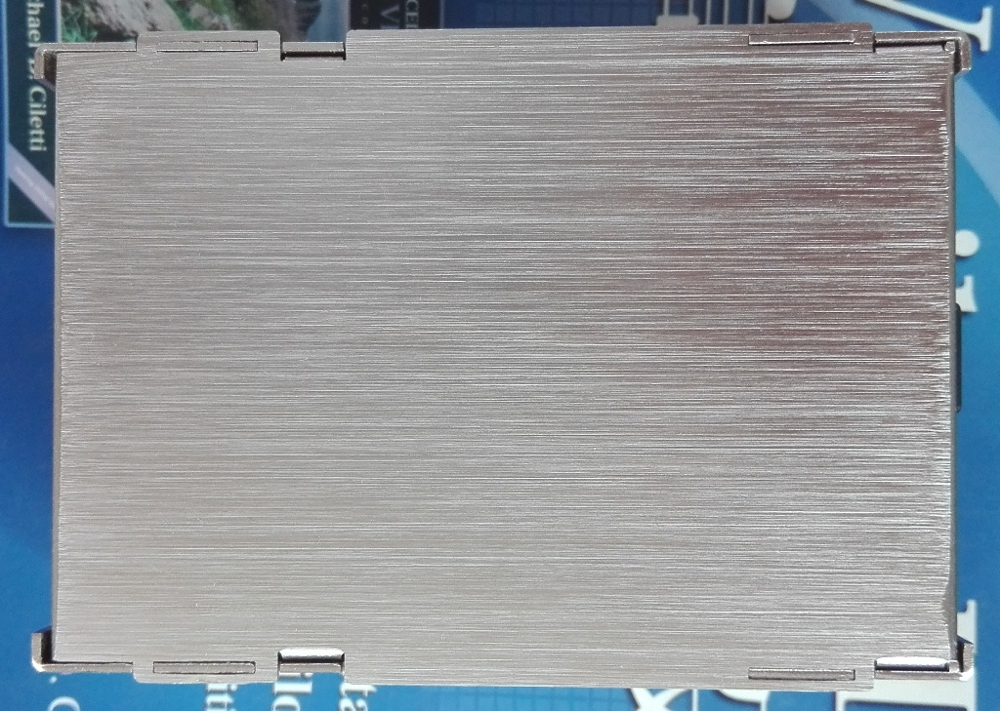

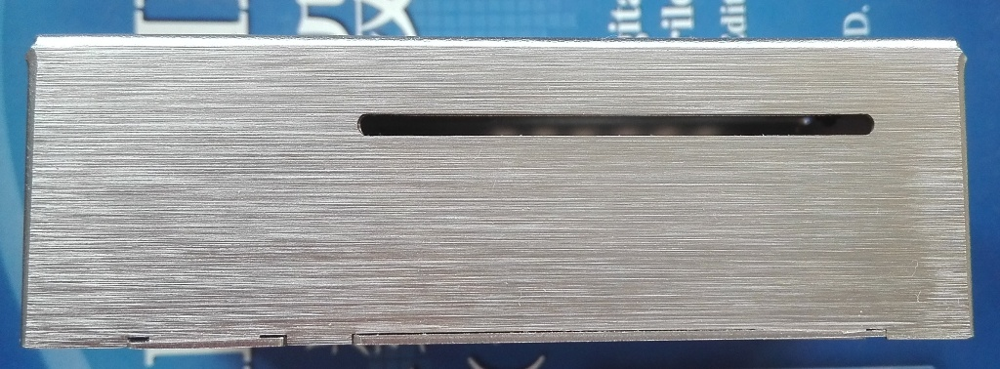

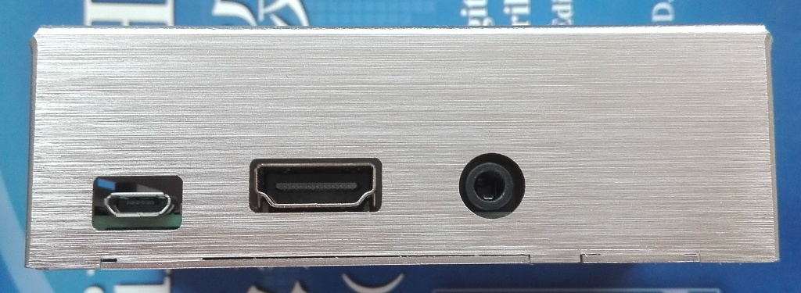

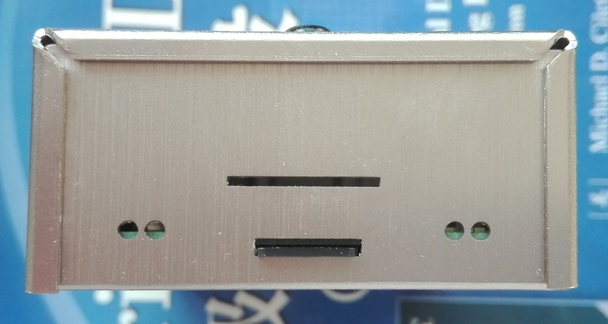

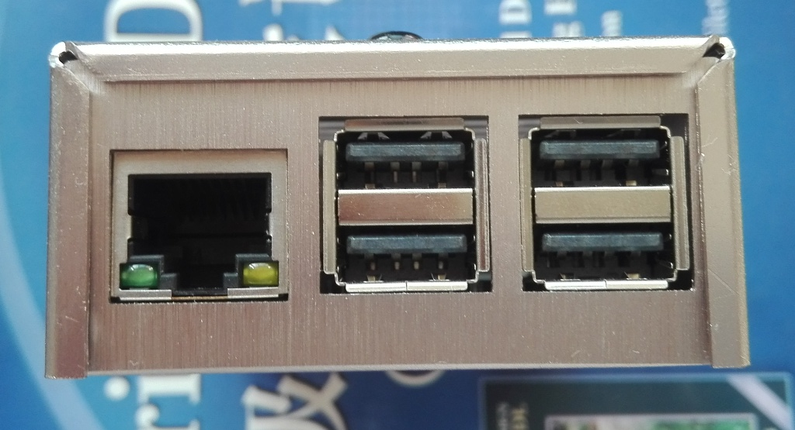

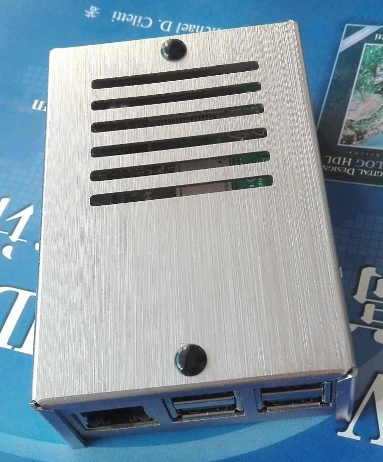