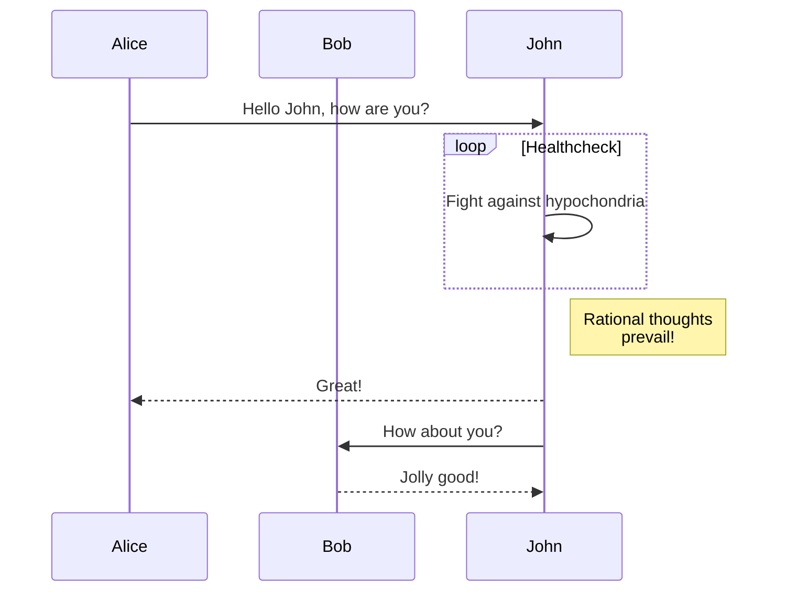

```flowchart
start=>start: 开始
input=>inputoutput: 输入
operation=>operation: 操作
condition=>condition: 操作出错？
output=>inputoutput: 输出
error=>operation: 请重新输入
end=>end: 结束

start->input
input->operation
operation->condition
condition(no,bottom)->output
condition(yes)->error(top)->input
output->end
```

