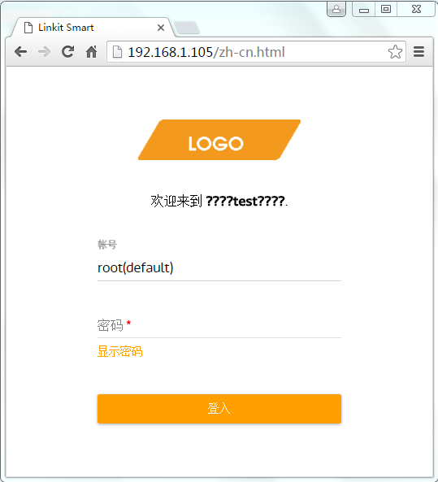

## 前言

对于旧版本的Linkit Smart 7688固件(v0.9.2)来讲，它的声卡对于我来讲它是正常的。怎么讲，我使用了WM8060的3类输出。Speaker，headphone，mono输出均有声音信号。但是经过firmware更新后（v0.9.3），新的固件只保留的headphone输出。对于Speaker和mono输出就消失了。怎么解决呢？只能靠自己了。

## 源代码位置 `\sound\soc\codecs\wm8960.c/h`

## 硬件分析

对于WM8960来讲，它的输出分为3类。它们的音频输出音量分别由它们的寄存器控制。可以参考WM8960规格书。



系统中一共有3个mixer。
* LOMIX mixer - 左声道输出混合器
* ROMIX mixer - 右声道输出混合器
* OUT3 mixer - mono输出混合器

## 软件分析

#### wm8960.c

```
struct wm8960_priv {
	struct regmap *regmap;
	int (*set_bias_level)(struct snd_soc_codec *,
			      enum snd_soc_bias_level level);
	struct snd_soc_dapm_widget *lout1;
	struct snd_soc_dapm_widget *rout1;
	struct snd_soc_dapm_widget *out3;
	bool deemph;
	int playback_fs;
};
```

```
static const struct snd_kcontrol_new wm8960_snd_controls[] = {
SOC_DOUBLE_R_TLV("Capture Volume", WM8960_LINVOL, WM8960_RINVOL, 0, 63, 0, adc_tlv),
SOC_DOUBLE_R("Capture Volume ZC Switch", WM8960_LINVOL, WM8960_RINVOL, 6, 1, 0),
SOC_DOUBLE_R("Capture Switch", WM8960_LINVOL, WM8960_RINVOL, 7, 1, 0),

SOC_SINGLE_TLV("Right Input Boost Mixer RINPUT3 Volume", WM8960_INBMIX1, 4, 7, 0, boost_tlv),
SOC_SINGLE_TLV("Right Input Boost Mixer RINPUT2 Volume", WM8960_INBMIX1, 1, 7, 0, boost_tlv),
SOC_SINGLE_TLV("Left Input Boost Mixer LINPUT3 Volume", WM8960_INBMIX2, 4, 7, 0, boost_tlv),
SOC_SINGLE_TLV("Left Input Boost Mixer LINPUT2 Volume", WM8960_INBMIX2, 1, 7, 0, boost_tlv),

SOC_DOUBLE_R_TLV("Playback Volume", WM8960_LDAC, WM8960_RDAC, 0, 255, 0, dac_tlv),

SOC_DOUBLE_R_TLV("Headphone Playback Volume", WM8960_LOUT1, WM8960_ROUT1, 0, 127, 0, out_tlv),
SOC_DOUBLE_R("Headphone Playback ZC Switch", WM8960_LOUT1, WM8960_ROUT1, 7, 1, 0),

SOC_DOUBLE_R_TLV("Speaker Playback Volume", WM8960_LOUT2, WM8960_ROUT2, 0, 127, 0, out_tlv),
SOC_DOUBLE_R("Speaker Playback ZC Switch", WM8960_LOUT2, WM8960_ROUT2, 7, 1, 0),
SOC_SINGLE("Speaker DC Volume", WM8960_CLASSD3, 3, 5, 0),
SOC_SINGLE("Speaker AC Volume", WM8960_CLASSD3, 0, 5, 0),

SOC_SINGLE("PCM Playback -6dB Switch", WM8960_DACCTL1, 7, 1, 0),
SOC_ENUM("ADC Polarity", wm8960_enum[0]),
SOC_SINGLE("ADC High Pass Filter Switch", WM8960_DACCTL1, 0, 1, 0),

SOC_ENUM("DAC Polarity", wm8960_enum[1]),
SOC_SINGLE_BOOL_EXT("DAC Deemphasis Switch", 0, wm8960_get_deemph, wm8960_put_deemph),

SOC_ENUM("3D Filter Upper Cut-Off", wm8960_enum[2]),
SOC_ENUM("3D Filter Lower Cut-Off", wm8960_enum[3]),
SOC_SINGLE("3D Volume", WM8960_3D, 1, 15, 0),
SOC_SINGLE("3D Switch", WM8960_3D, 0, 1, 0),

SOC_ENUM("ALC Function", wm8960_enum[4]),
SOC_SINGLE("ALC Max Gain", WM8960_ALC1, 4, 7, 0),
SOC_SINGLE("ALC Target", WM8960_ALC1, 0, 15, 1),
SOC_SINGLE("ALC Min Gain", WM8960_ALC2, 4, 7, 0),
SOC_SINGLE("ALC Hold Time", WM8960_ALC2, 0, 15, 0),
SOC_ENUM("ALC Mode", wm8960_enum[5]),
SOC_SINGLE("ALC Decay", WM8960_ALC3, 4, 15, 0),
SOC_SINGLE("ALC Attack", WM8960_ALC3, 0, 15, 0),

SOC_SINGLE("Noise Gate Threshold", WM8960_NOISEG, 3, 31, 0),
SOC_SINGLE("Noise Gate Switch", WM8960_NOISEG, 0, 1, 0),

SOC_DOUBLE_R_TLV("ADC PCM Capture Volume", WM8960_LADC, WM8960_RADC, 0, 255, 0, adc_tlv),

SOC_SINGLE_TLV("Left Output Mixer Boost Bypass Volume", WM8960_BYPASS1, 4, 7, 1, bypass_tlv),
SOC_SINGLE_TLV("Left Output Mixer LINPUT3 Volume", WM8960_LOUTMIX, 4, 7, 1, bypass_tlv),
SOC_SINGLE_TLV("Right Output Mixer Boost Bypass Volume", WM8960_BYPASS2, 4, 7, 1, bypass_tlv),
SOC_SINGLE_TLV("Right Output Mixer RINPUT3 Volume", WM8960_ROUTMIX, 4, 7, 1, bypass_tlv),
};
```
####

#### Output Mixer Enable Control
* R47(2Fh) - Power Mgmt(3)//WM8960_POWER3
    * bit5 - LMIC/Left Channel Input FGA Enable 0=disable
    * bit4 - RMIC/Right Channel Input FGA Enable
    * bit3 - LOMIX/Left Output Mixer Enable Control
    * bit2 - ROMIX/Right Output Mixer Enable Control

* R26(1Ah)-Power Mgmt(2)//WM8960_POWER2
    * Bit1(0x002) - OUT3/0 - OUT3 Output Buffer


#### Left and Right Output Mixer Mute and Volume Control

* R34(22h) - Left Output Mixer Control //WM8960_LOUTMIX
    * bit8 - LD2LO/0 - Left DAC to Left Output Mixer
    * bit7 - LI2LO/0 - LINPUT3 to Left Output Mixer
    * bit[6:4] - INPUT3 to Left Output Mixer Volume
* R45(2Dh) - Bypass(1) //WM8960_BYPASS1
    * bit7 - LB2LO/0 - Left Input Boost Mixer to Left Output Mixer
    * bit[6:4] - LB2LOVOL[2:0]/101 - Left Input Boost Mixer to Left Output Mixer Volume
* R37(25h) - Right Output Mixer Control //WM8960_ROUTMIX
* R46(2Eh) - Bypass(2) //WM8960_BYPASS2

#### Output Mixer Enable Control

* R38(26h) - Mono Output Mix(1) //WM8960_MONOMIX1
    * bit7 - L2MO/0 - Left Output Mixer to Mono Output Mixer Control
* R39(27h) - Mono Output Mix(2) //WM8960_MONOMIX2
    * bit7 - R2MO/0 - Right Output Mixer to Mono Output Mixer control
* R42(2Ah) - Mono Output Volume //WM8960_MONO
    * bit6 - MOUTVOL - Mono Output Mixer Volume Control. 0=0dB,1=-6dB

相关寄存器

* R26(1Ah)-Power Mgmt(2)
    * bit8(0x100) - DACL/0 - DAC Left 0=Power Down 1=Power up
    * bit7(0x080) - DACR/0 - DAC Right
    * bit6(0x040) - LOUT1/0 - LOUT1 Output Buffer
    * bit5(0x020) - ROUT1/0 - ROUT1 Output Buffer
    * bit4(0x010) - SPKL/0 - SPK_LP/SPK_LN OUtput Buffers
    * Bit3(0x008) - SPKR/0 - SPK_RP/SPK_RN Output Buffers
    * Bit1(0x002) - OUT3/0 - OUT3 Output Buffer
    * Bit0(0x001) - PLL_EN/0 - PLL Enable
* R38(26h) Mono out mix(L2MO)/0 - Left Output Mixer to Mono Output Mixer Control
* R39(27h) Mono out Mix(R2MO)/0 - Right Output Mixer to Mono Ooutput Mixer Control
* R42(2Ah)-MONOOUT Volume*

## wm8960 register

* R2(02h)-LOUT1 volume
* R3(03h)-ROUT1 volume
* R10(0Ah)-Left DAC volume
    * bit8(0x100) - DAC Volume Update
    * bit7:0 - LDACVOL[7:0]/1111 1111 - Left DAC Digital Volume Control
        * 0000 0000=Digital Mute;
        * 0000 0001=-127dB
        * 0000 0010=-126.5dB
        * ...0.5dB steps up to
        * 1111 1111=0db
* R11(0Bh)-Right DAC volume
* R26(1Ah)-Power Mgmt(2)
    * bit8(0x100) - DACL/0 - DAC Left 0=Power Down 1=Power up
    * bit7(0x080) - DACR/0 - DAC Right
    * bit6(0x040) - LOUT1/0 - LOUT1 Output Buffer
    * bit5(0x020) - ROUT1/0 - ROUT1 Output Buffer
    * bit4(0x010) - SPKL/0 - SPK_LP/SPK_LN OUtput Buffers
    * Bit3(0x008) - SPKR/0 - SPK_RP/SPK_RN Output Buffers
    * Bit1(0x002) - OUT3/0 - OUT3 Output Buffer
    * Bit0(0x001) - PLL_EN/0 - PLL Enable

* R38(26h) Mono out mix(L2MO)/0 - Left Output Mixer to Mono Output Mixer Control
* R39(27h) Mono out Mix(R2MO)/0 - Right Output Mixer to Mono Ooutput Mixer Control
* R40(28h)-LOUT2 volume //SPKVU
* R41(29h)-ROUT2 volume //SPKVU
* R42(2Ah)-MONOOUT Volume*
* R49(31h)-Class D Control(1)
* R51(33h)-Class D Control(3)
