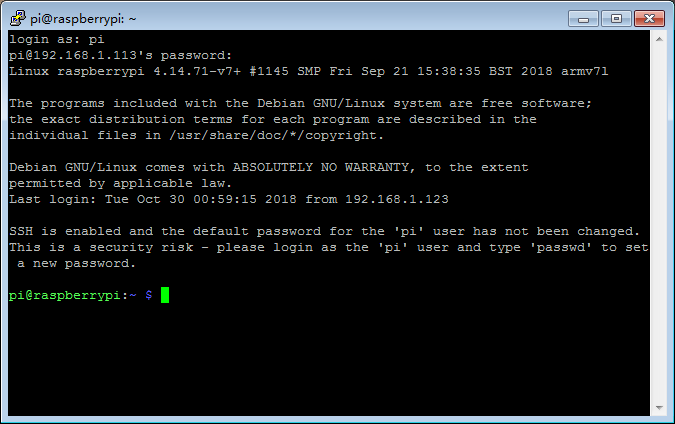
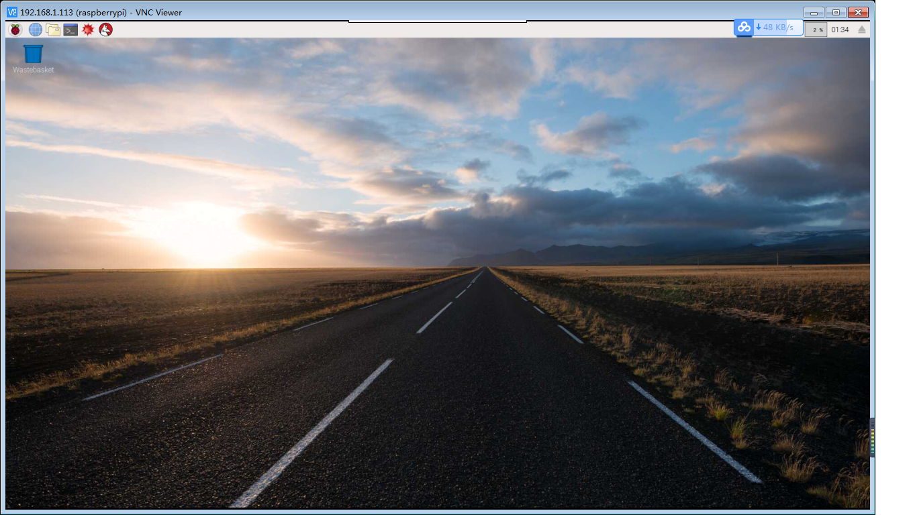

# RaspberryPI install


## 名词

* Raspberry Pi - 树莓派
* SSH
* VNC


## REQ


#### RaspberryPi镜像文件下载

我们可以在<www.raspberrypi.org/downloads/>下载Raspberry Pi的各版本镜像文件.我选择的是NOOBS,这是Raspberry Pi自己维护的系统版本.<http://director.downloads.raspberrypi.org/NOOBS/images/NOOBS-2018-10-11/NOOBS_v2_9_0.zip>

#### 制作系统Micro-SD卡


#### RaspberryPI反复复位

这个问题很LOW.很LOW业很重要.对于RaspberryPI类的产品,电流需要比较大.所以电源也相对苛刻.不能在某宝上随便搞个电源或USB线就可以搞定了.要知道,大多数的品质是LOW的.我也是反复搞了几把,还是不行.最后还是用了生产用的火牛才搞定.毕竟这个生产用的电源是货真价实的玩艺儿.然后,就将RaspberryPI彻底给征服了.

#### 如何更改RaspberryPi的键盘布局

为什么要更改键盘呢?我用的键盘是Fuhlen的无线键盘鼠标,在使用当中发现我的@和"两个字符翻了,用了习惯了.反过来用真的很别扭.另外说明,我用的是默认的英国板OS.所以键盘也是默认的UK模式键盘.更改吧.

```
sudo raspi-config
```
进入后选择101键PC键盘. `Generic 101-key PC/Other/English(US)/English(US)-English (US, alternative international)`,按Tab键到OK,按Enter确定.OK了键盘恢复正常了.

#### 音乐播放

将耳机/音响插入RaspberrPi的音频插孔,通过浏览器进入`mp3.baidu.com`,随便选取你想听的歌曲,OK了,RaspberrPi播放出了优美的音乐声.

#### SSH登入RaspberryPi

* 在桌面下使能SSH服务

首先，我们要打开RaspberryPi的SSH服务器功能，我们可以在开始菜单来进行设置：start menu/Preferences/Raspberry Pi Configuration/Interfaces/SSH Enabled.

* 在命令行下使能SSH服务

输入`sudo raspi-config`,在菜单中选择5 Interfacing Options/P2 SSH/ <Yes>

使能后，我们就可以在其它设备上通过ssh客户端登陆RaspberryPi，并对它进行操作了．RaspberryPi默认用户名: pi,密码: raspberry


putty下载地址：<https://www.putty.org/>

 

#### vnc登陆

和SSH相同，我们要先在Raspberry Pi Configuration工具软件的Interfaces中使能VNC服务．服务启动后会在RaspberryPi桌面右上角显示ＶＮＣ标志．然后，我们就可以在其它设备上通过VNC Viewer来连接RaspberryPi了，和SSH登陆相同，填写正确的用户名密码，然后你就可以直接操作RaspberryPi了．记住奥，这可以桌面显示的奥，你可以将RaspberryPi的显示器节约下来了．

vnc view下载地址：<https://www.realvnc.com/en/connect/download/viewer/>



